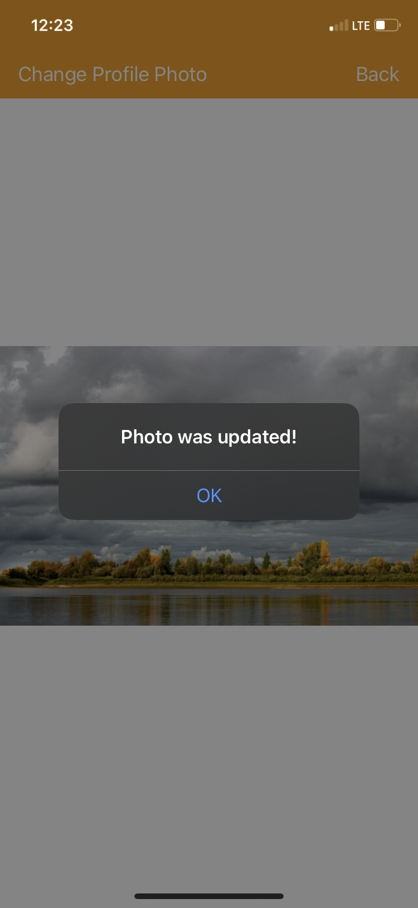
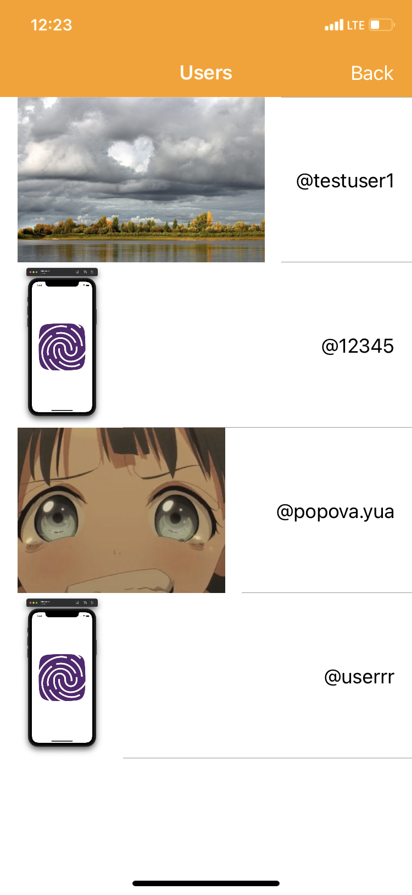

# Photo Gallery

Чтобы запустить приложение, необходимо склонировать репозиторий и открыть PhotoGallery.xcodeproj с помощью XCode.

Приложение было свёрстано без использования xib и storyboard. Для компонент, встречающихся в интерфейсе неоднократно, были сверстаны переиспользуемые UI элементы.

Все данные хранятся с помощью UserDefaults, включая текущую фотографию пользователя.

При клике на ячейку CollectionView открывается изображение во весь размер, с возможностью обновить изображение профиля пользователя.

   
